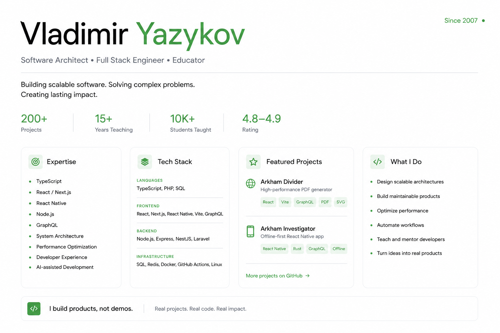

  

**Senior Fullstack Engineer • Software Architect • Educator**

Building production software since 2007.

I specialize in **TypeScript**, **React**, **Node.js**, **React Native** and software architecture. I enjoy building maintainable products, developer tools and high-performance applications.

---

## Current Focus

* React & React Native
* TypeScript
* Node.js
* Software Architecture
* Performance Optimization
* AI-assisted Development

---

## Tech Stack

**Languages**
TypeScript • PHP • SQL

**Frontend**
React • Next.js • React Native • Vite • GraphQL

**Backend**
Node.js • Express • NestJS • Laravel

**Infrastructure**
PostgreSQL • Docker • Redis • GitHub Actions

---

## Highlights

* 18+ years in software engineering
* 200+ commercial projects
* 15+ years teaching developers
* 10k+ students taught
* Open source enthusiast

---

## Connect

[Telegram](https://t.me/neizerth) • [LinkedIn](https://www.linkedin.com/in/vladimir-yazykov-4556a287) • [Email](neizerth@gmail.com)
